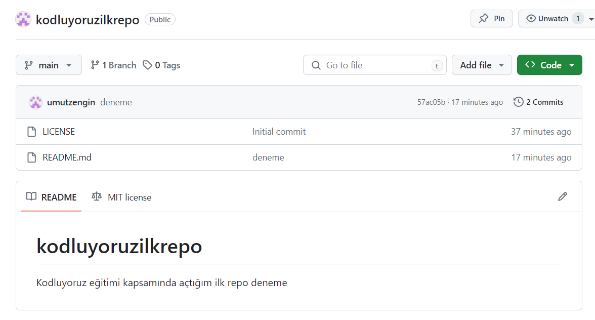

# Kodluyoruz İlk Repo
Bu repo [Kodluyoruz](https://kodluyoruz.org) Front-End Eğitiminde oluşturduğumuz ilk repo. İçerisinde bir adet README dosyası, bir adet index.html barındırıyor.



## Installation
Öncelikle projeyi clonelayın.
```
git clone https://github.com/umutzengin/kodluyoruzilkrepo.git
```
## Usage
Projeyi cloneladıktan sonra Visual Studio ode programını açınız.

Linux için:
```
cd kodluyoruzilkrepo
code .
```
## Contributing
Pull requestler kabul edilir. Büyük değişiklikler için, lütfen önce neyi değiştirmek istediğinizi tartışmak için bir konu açınız.

## License
 [MIT](https://choosealicense.com/licenses/mit/)